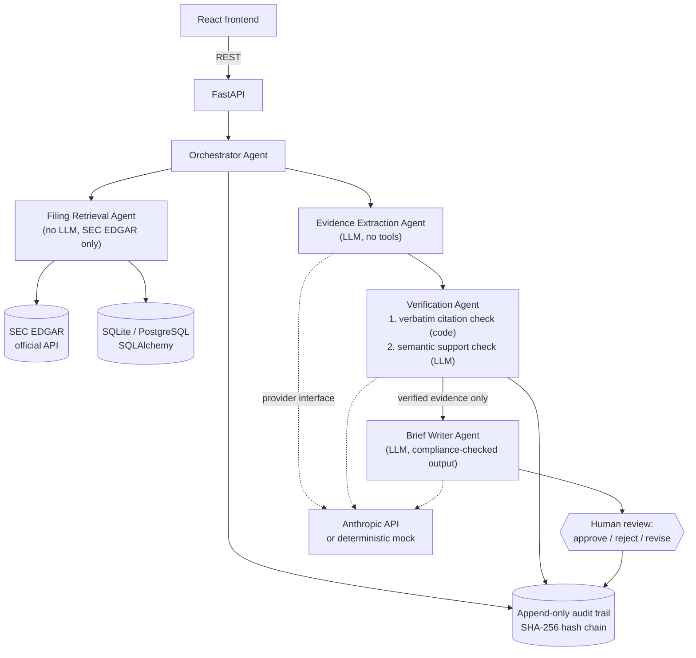

# Investment Research Evidence Agent

An AI-assisted research platform that analyzes public SEC filings (10-K / 10-Q)
and produces **evidence-backed company research briefs** — every claim cited to
the exact filing text, independently verified by a separate agent, and gated
behind human approval, with a tamper-evident audit trail.

> **Disclaimer:** This project is for research and education only. It analyzes
> public documents; it does **not** provide investment advice, price targets,
> or buy/sell/hold recommendations of any kind.

## The problem

Analysts spend hours reading hundreds of pages of SEC filings to answer
questions like *"what changed in this company's risk factors?"*. Large language
models can read those pages in seconds — but a raw LLM answer is unusable in a
financial-services setting because it can hallucinate numbers, invent
quotations, and cite sections that don't exist. The interesting engineering
problem is not "summarize a filing"; it is **making model output trustworthy
enough to act on**: grounding, verification, provenance, and human control.

## Why an agentic workflow

A single prompt cannot be audited. Splitting the work across agents with
narrow responsibilities and typed interfaces gives properties a monolithic
prompt can't:

- **Separation of generation and verification.** The agent that proposes
  claims never judges them; a separate verification agent checks each claim
  against its cited source and blocks what it can't confirm.
- **Least privilege.** The only component with network access to SEC EDGAR is
  the retrieval agent, which has no LLM. The agents that read untrusted filing
  text have no tools at all — they can only return JSON.
- **Provenance by construction.** Citation metadata (accession numbers, dates,
  URLs) is attached by trusted code from the database, never generated by a
  model, so it cannot be hallucinated.
- **Auditability.** Every agent action, verdict, and human decision is a typed
  record in an append-only, hash-chained audit log.

## Architecture



### Agent responsibilities

| Agent | Responsibility | LLM? | Tools |
|---|---|---|---|
| Orchestrator | Routes typed data between agents, tracks workflow state, records audit events. Never draws conclusions itself. | no | database |
| Filing Retrieval | Company search, filing lists, document download and section parsing via official SEC EDGAR APIs (fair-access compliant, cached). | no | SEC EDGAR |
| Evidence Extraction | Proposes evidence objects (claim + verbatim excerpt + section + confidence) for a research question. Flags injection attempts. Reports missing info instead of inventing it. | yes | none |
| Verification | Independently classifies every claim: supported / partially supported / unsupported / contradicted. Layer 1 is a deterministic verbatim-citation check in code; layer 2 is a semantic LLM check. Unsupported claims are blocked. | yes | none |
| Brief Writer | Receives **only verified evidence** (enforced at runtime), writes a markdown brief with inline `[E#]` citations, separates facts from interpretation. Output is rejected if it contains investment-advice language. | yes | none |

## Technology stack

- **Backend:** Python 3.14, FastAPI, Pydantic v2, SQLAlchemy 2.0, httpx
- **LLM:** Anthropic API behind a provider interface, with a deterministic
  grounded mock (`LLM_PROVIDER=mock`) so everything runs without an API key
- **Database:** SQLite for local dev; `DATABASE_URL` makes PostgreSQL a config change
- **Frontend:** React 18 + TypeScript + Vite, no UI framework, accessible components
- **Testing:** pytest (42 tests), ruff, offline evaluation harness
- **Ops:** Docker + Docker Compose, GitHub Actions CI, structured JSON logging

## Local setup

Prerequisites: Python 3.12+ (developed on 3.14) and Node 22+.

```bash
# Backend
cd backend
python3 -m venv .venv
source .venv/bin/activate
pip install -r requirements-dev.txt
cp ../.env.example .env          # optional — mock mode works with no .env at all
uvicorn app.main:app --reload    # http://localhost:8000 (docs at /docs)
```

```bash
# Frontend (second terminal)
cd frontend
npm install
npm run dev                      # http://localhost:5173, proxies /api to :8000
```

### Docker

```bash
docker compose up --build        # frontend at http://localhost:8080
```

(Compose files are provided and CI exercises the same install/test steps on
Linux; note that Docker was not available on the development machine, so run
`docker compose up` once locally before relying on it.)

### Environment variables

All configuration is environment-driven (see `.env.example`). Key variables:

| Variable | Default | Purpose |
|---|---|---|
| `LLM_PROVIDER` | `mock` | `mock` (deterministic, free) or `anthropic` |
| `ANTHROPIC_API_KEY` | — | required only when `LLM_PROVIDER=anthropic` |
| `ANTHROPIC_MODEL` | `claude-sonnet-5` | model used for agent calls |
| `SEC_USER_AGENT_NAME` / `SEC_CONTACT_EMAIL` | — | SEC fair-access requires a declared User-Agent with contact info |
| `DATABASE_URL` | `sqlite:///./data/app.db` | swap for `postgresql+psycopg://…` in production |

No credentials are hard-coded or committed; `.env` is gitignored.

### Running with the mock LLM

The default. The mock provider is **not canned strings** — it extracts real
sentences from the actual filing text by keyword relevance, so citations are
genuinely valid and the verification pipeline is exercised for real. The whole
app, the test suite, and the evaluation run deterministically with no API key.

### Tests, lint, and evaluation

```bash
cd backend
pytest                            # 42 tests
ruff check app/ tests/ eval/      # lint
python eval/run_eval.py --check   # 12-question evaluation with thresholds
```

## Example research workflow

1. Search **MSFT** → real matches from SEC's ticker directory.
2. Pick the latest **10-K** → downloaded once from EDGAR, parsed into named
   sections (Item 1, 1A, 7, …) and cached in the database.
3. Ask *"What are the most significant risk factors disclosed?"*
4. The pipeline runs: sections selected → evidence extracted (verbatim
   excerpts) → each claim verified → brief written from verified evidence only.
5. Review the evidence table (claims, excerpts, sources, confidence, verdicts),
   read the cited brief, and **approve / reject / request revision**.
6. Inspect the audit log: every step, actor, and decision, hash-chained.

## Responsible-AI design (summary)

Responsible AI here is architecture, not a disclaimer — details in
[docs/responsible-ai.md](docs/responsible-ai.md):

- Source-grounded responses; excerpts must appear **verbatim** in the cited
  section (checked by code, not by a model).
- Separate generation and verification agents; unsupported claims are blocked
  before the brief is written.
- Confidence scores and explicit uncertainty/missing-information notes.
- Human approval gate — no brief is final without a recorded human decision.
- Append-only, hash-chained audit trail (`GET /api/audit/verify` detects tampering).
- Filing text is treated as untrusted data: delimiter-wrapped, injection-scanned
  (findings surface in the audit log), and processed by tool-less agents.
- Brief output is compliance-checked: investment-advice language causes the
  brief to be rejected, and the research-only disclaimer is always present.

## Evaluation

An offline, deterministic harness (12 questions across three synthetic fixture
filings, plus hand-labeled verification probes) measures citation validity,
claim support rate, unsupported-claim rate, blocked-claim leakage, retrieval
relevance, verification agreement, and completion time. One probe is a
fabricated citation that **must** be blocked; CI fails if it isn't. See
[docs/evaluation.md](docs/evaluation.md) for metric definitions and current
results.

## Known limitations

- Section parsing is heuristic; unusual filing markup falls back to
  fixed-size chunks (research still works, section names are less precise).
- Retrieval is keyword + task-prior based (no embeddings yet) — transparent
  and testable, but it can select more sections than needed.
- The mock verifier is lexical; nuanced semantic contradictions need the real
  LLM provider.
- Single-process background execution; a production deployment would use a task
  queue (see below).
- No authentication — out of scope for the MVP by design.

## Future improvements

- Embedding-based retrieval with the same measured-recall evaluation.
- Alembic migrations and PostgreSQL in compose.
- Task queue (e.g. Redis + worker) for pipeline execution and retries.
- XBRL structured-data cross-checks for numeric claims.
- Diff-style comparison view for two filings.

## Screenshots

The screens below can be reproduced locally in under a minute (mock mode):
company search → filing list → research form → evidence & verification table →
cited brief with review controls → audit log. Add captures to
`docs/screenshots/` and link them here; screenshots are intentionally not
committed as binary placeholders.

## Disclaimer

This software is an educational research tool. It does not provide investment
advice or recommendations, and its output must not be used as the basis for
investment decisions.
