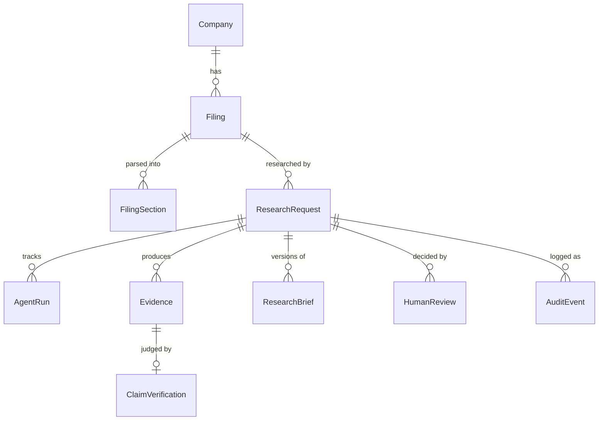

# Architecture

## Layering

```
frontend/            React + TypeScript UI (talks only to the REST API)
backend/app/
  api/               HTTP routes — thin: validate, call services/agents, serialize
  agents/            the five agents + orchestrator (pipeline logic)
  llm/               provider interface: Anthropic implementation + grounded mock
  services/          SEC client, filing parser, relevance ranking, audit,
                     injection guard, text utilities
  schemas/           Pydantic models: API contracts and agent I/O contracts
  db/                SQLAlchemy engine, session management, ORM models
```

Rules that keep the layering honest:

- Routes never contain business logic; they validate input, call one service or
  agent method, and shape the response.
- Agents never import FastAPI. Extraction/verification/brief agents are pure
  (LLM + logic, no database) so they are unit-testable with fake providers; the
  orchestrator owns persistence.
- Only `config.py` reads the environment. Only `sec_client.py` performs network
  I/O. Only the provider implementations know an LLM vendor exists.

## Data model



Notable choices:

- **Status fields are short strings**, validated by Pydantic at the API
  boundary, not database enums — adding a state never requires a migration.
- **Evidence stores citation fields denormalized** (accession number, filing
  date, URL) so an evidence row is a self-contained, portable citation even if
  read outside the app.
- **ResearchBrief is versioned**; a revision inserts a new row rather than
  updating, preserving history for the audit story.
- **AuditEvent is append-only** with `hash = SHA-256(prev_hash | actor | type |
  payload | timestamp)`. `/api/audit/verify` recomputes the chain; editing or
  deleting any historical row breaks every hash after it.
- Timestamps are naive UTC on purpose: SQLite stores datetimes without a zone,
  and a tz-aware value would round-trip differently than written — which would
  falsely break the audit hash chain.

## Request flow (research)

1. `POST /api/research` validates the question (length, control characters,
   task-specific requirements like a comparison filing), writes the request
   row and an audit event, then schedules the orchestrator on a background
   task and returns `202` immediately.
2. The orchestrator (own DB session, since it runs on a worker thread):
   - ensures the filing is ingested (download happens once; sections cached),
   - ranks sections by task priors + keyword overlap (top 3, or 2 per filing
     for comparisons),
   - runs extraction → persists `Evidence` rows (`proposed`),
   - runs verification per claim → persists `ClaimVerification`, flips
     evidence to `verified` or `blocked`,
   - runs the brief writer with verified evidence only → persists
     `ResearchBrief` v1 → status `awaiting_review`.
   Any exception marks the request `failed` with the error visible in the API
   and the audit log.
3. The frontend polls `GET /api/research/{id}` (1.5 s) and renders progress
   from the `AgentRun` rows.
4. `POST /api/research/{id}/review` records the human decision. `approved` and
   `rejected` are terminal; `revision_requested` regenerates the brief from the
   same verified evidence with the reviewer's comment and returns to
   `awaiting_review`.

## SEC EDGAR integration

Official endpoints only:

- `company_tickers.json` for ticker→CIK lookup (cached in memory for an hour),
- `data.sec.gov/submissions/CIK##########.json` for filing history,
- `www.sec.gov/Archives/...` for the primary document.

Fair-access compliance: declared `User-Agent` with contact email (required by
SEC policy), a client-side throttle well below the 10 req/s limit, and
database caching so each document is fetched exactly once. Errors are
translated into a typed `SecError` and surfaced as HTTP 502 with a clear
message; invalid tickers and missing filings return empty results rather than
errors.

## Filing parsing

Two stages, both dependency-free:

1. **HTML → text** with a small `html.parser.HTMLParser` subclass: skips
   `script`/`style`, inserts newlines at block-tag boundaries, decodes
   entities, normalizes non-breaking spaces.
2. **Sectioning** by `Item N` headings at line starts, case-insensitive.
   Table-of-contents artifacts are dropped by a minimum-length filter, and
   when the same item appears twice the longer body wins. 10-Q item numbers
   repeat between Part I and Part II, so the parser tracks the most recent
   `PART` marker and namespaces keys (`I-2`, `II-1A`). If fewer than two
   sections are found (unusual markup), the parser falls back to fixed-size
   chunks so research still works.

This is deliberately best-effort: SEC filings are wildly inconsistent, and the
downstream pipeline only needs "good enough" section boundaries because every
excerpt is re-verified against stored text regardless of how it was sectioned.

## LLM provider interface

Agents call `provider.run_task(task_name, payload) -> dict` and validate the
result with Pydantic. Two implementations:

- **AnthropicProvider** renders payloads into prompts (`llm/prompts.py`),
  calls the Messages API, parses strict JSON with one corrective retry, and
  raises a typed `LLMError` on failure.
- **MockProvider** computes results from the payload itself: extraction
  returns real sentences from the provided sections scored by keyword overlap;
  verification scores claim/excerpt token overlap and polarity; the brief
  writer assembles markdown from its inputs. Deterministic, offline, and
  grounded — the safety pipeline is exercised for real in tests and CI.

The model is never asked to produce citation metadata. `filing_label` +
`section_name` are the only provenance the model outputs; trusted code maps
those to accession numbers, dates, and URLs, and anything that doesn't map is
dropped or fails verification.

## Scaling path (deliberate MVP simplifications)

| MVP choice | Production replacement |
|---|---|
| SQLite | PostgreSQL (only `DATABASE_URL` changes; no SQLite-only features used) |
| `create_all()` at startup | Alembic migrations |
| FastAPI BackgroundTasks | task queue (Redis/Celery or arq) with retries |
| keyword retrieval | embeddings + reranking, evaluated with the same recall metric |
| single container | separate API/worker deployments behind the same interface |
